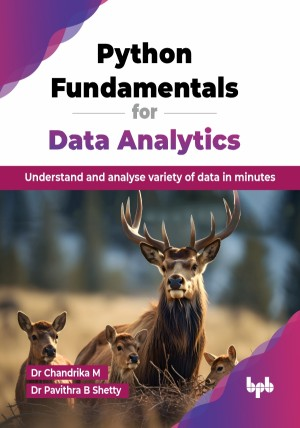

# Python Fundamentals for Data Analytics

Understand and analyse variety of data in minutes.

This is the repository for [Python Fundamentals for Data Analytics
](https://bpbonline.com/products/python-fundamentals-for-data-analytics?variant=44189893820616),published by BPB Publications.

## About the Book
Python is a simple, easy-to-learn, and one of the top programming languages across the globe. As a result of advancements in AI, data mining, and numerical computing fields, Python has become a popular programming language catering to various stakeholders. It is a powerful tool for working with a variety of data. This book provides the basics of Python and an introduction to data analytics.

This book offers a complete introduction to Python programming, covering everything from the basics to the advanced topics. It starts by explaining core concepts like syntax and the Python interpreter, then dives into data structures, control flow, functions, and modules. You will also learn about data analysis and visualization with popular libraries like NumPy, Pandas, Matplotlib, and Seaborn. It wraps up with practical case studies, showing how to apply Python in real-world scenarios effectively.

The book serves as a step-by-step guide to performing data analysis. Its content is designed so that even a novice can learn and perform data analysis and visualization simply by following the instructions in the book.  

## What You Will Learn
• Understand the basics of programming languages and the role of the Python interpreter.

• Read about different data structures like lists, sets, tuples, and dictionaries, and understand their applications.

• Learn how to work with files in Python, including reading, writing, and appending data.

• Discover how to use NumPy and Pandas for efficient data manipulation and analysis.

• Learn how to create informative visualizations using Matplotlib and Seaborn.
